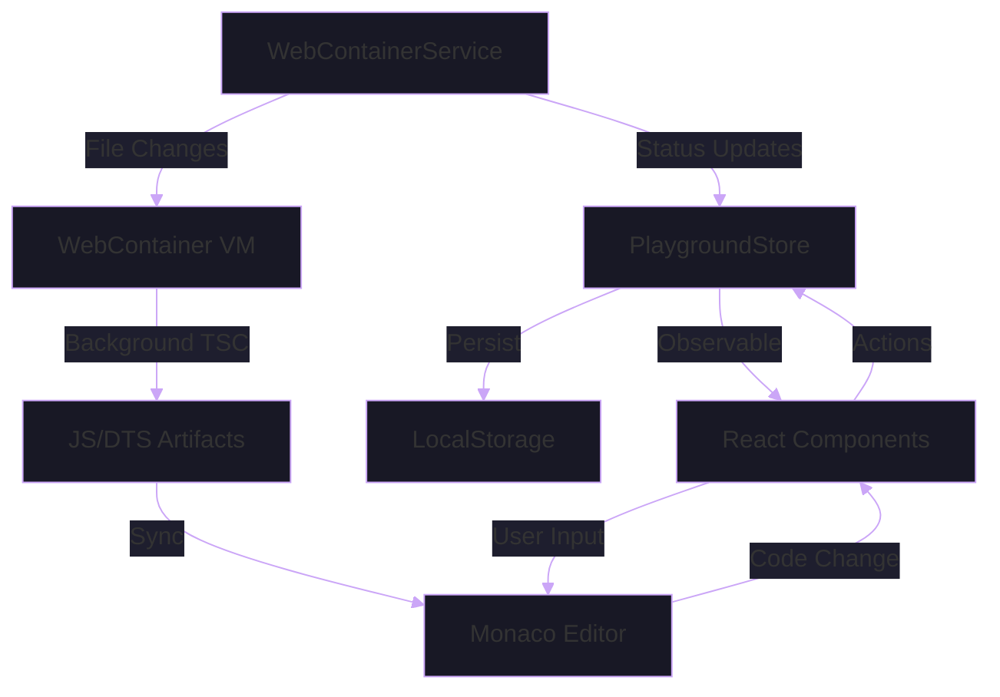
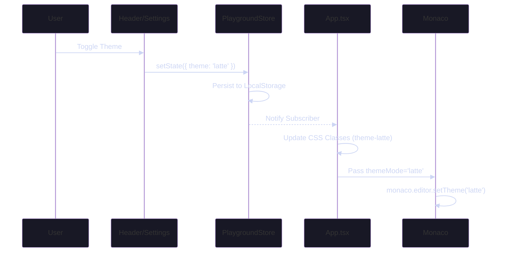

# State Management in TSPlay

This document outlines the flow of state across the application, from the central store to the WebContainer and the UI.

## Overview

TSPlay uses a centralized state machine approach to manage the lifecycle of the playground environment, code compilation, and user preferences.

## Core Components

### 1. PlaygroundStore (`src/lib/state-manager.ts`)
The "Source of Truth" for application-level state.
- **Responsibility**: Tracks environment lifecycle (`idle`, `booting`, `ready`), compiler status (`TSC`, `Esbuild`), and user settings (`theme`, `lineWrap`).
- **Mechanism**: A simple observer pattern with a `subscribe` method and an `operationQueue` for sequential async tasks.

### 2. WebContainerService (`src/lib/webcontainer.ts`)
The orchestrator for the WebContainer VM.
- **Responsibility**: Booting the container, mounting files, spawning processes, and managing the filesystem.
- **Integration**: Emits logs to the UI and updates the `PlaygroundStore` with lifecycle transitions.

### 3. Hooks (`src/hooks/`)
Bridges between the services and the UI.
- **`usePlaygroundStore`**: Connects React components to the central store.
- **`useWebContainer`**: Handles the mounting of the initial environment and syncs filesystem changes.
- **`useCompilerManager`**: Manages the execution flow of the user's code.

## Theme Synchronization

TSPlay implements a unified theme system where a single `ThemeMode` drives both the Tailwind UI and the Monaco Editor.

## Build Integrity (The "Versioned" Sync)

To ensure the executed code matches the source, every filesystem write increments an internal version. The `WebContainerService` waits for the background compiler to emit artifacts that match the latest version before allowing execution.
