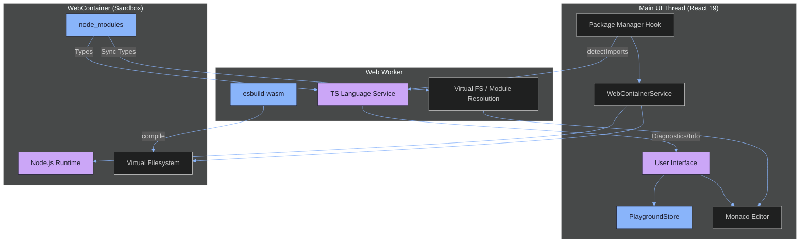

<!-- AGENT PROMPT: Please update this file after every message if it is relevant. Continuous updates ensure that the documentation accurately reflects the current state of the codebase, project specification, and architectural principles. -->

<h1 style="color: #cba6f7; font-size: 3rem; margin-top: 0; text-shadow: 0 0 20px rgba(203, 166, 247, 0.4);">✨ TSPlay Architecture</h1>

A high-fidelity, browser-native TypeScript development environment powered by WebContainers.

<h3 style="color: #cba6f7; margin-top: 0; text-align: center;">🗺️ System Relationships</h3>

  

    <h3 style="color: #89b4fa; margin-top: 0;">🌐 UI & Orchestration</h3>
    <ul style="margin-bottom: 0; padding-left: 1.2rem;">
      <li>React 19 Functional Core</li>
      <li>Monaco Editor Integration</li>
      <li>PlaygroundStore (Observable)</li>
      <li>WebContainer Lifecycle Mgmt</li>
    </ul>
  

  

    <h3 style="color: #89b4fa; margin-top: 0;">⚙️ Processing Engine</h3>
    <ul style="margin-bottom: 0; padding-left: 1.2rem;">
      <li>Dedicated TS Worker</li>
      <li>esbuild-wasm (JS Emission)</li>
      <li>TS Language Service (Types)</li>
      <li>Virtual FS Module Resolution</li>
    </ul>
  

---

<h2 style="color: #fab387; margin-top: 2.5rem;">📦 Dependency Reconciliation</h2>

To ensure a smooth typing experience, TSPlay implements a state-based reconciliation loop for <code>npm</code> packages:

  <code style="color: #a6e3a1;">Debounce (2.5s) ➜ Analyze Imports ➜ Calculate Delta ➜ Execute Batch ➜ Sync FS</code>

- **Delta Calculation**: Identifies exactly which packages need to be added or removed.
- **Auto-Types Discovery**: Automatically queries the npm registry for <code>@types/</code> equivalents.
- **ESM Readiness**: Automatically manages <code>package.json</code> with <code>"type": "module"</code> to ensure seamless ES module execution in Node.js.

---

<h2 style="color: #fab387; margin-top: 2.5rem;">📂 Dual-Layer Type Parity</h2>

TSPlay achieves 100% execution-to-editor parity by synchronizing type definitions from two distinct layers:

1. <b style="color: #cba6f7;">ATA Layer</b>: High-speed, CDN-based type acquisition for immediate feedback during typing.
2. <b style="color: #cba6f7;">Container Sync Layer</b>: A deep recursive crawl (up to 30 levels) of the WebContainer's <code>node_modules</code>. It synchronizes both <code>.d.ts</code> and <code>package.json</code> files, ensuring Monaco resolves types exactly like the Node.js runtime.

---

<h2 style="color: #fab387; margin-top: 2.5rem;">⚡ The Execution Sandbox</h2>

When you click Run, the following occurs:

- Code is compiled to ESM via <code>esbuild</code>.
- Assets are mounted to the <b>WebContainer virtual filesystem</b>.
- A <code>node</code> process is spawned within the browser's sandbox.
- Output is streamed to the UI with full <b>ANSI color support</b> and yielding mechanisms to prevent UI starvation.

