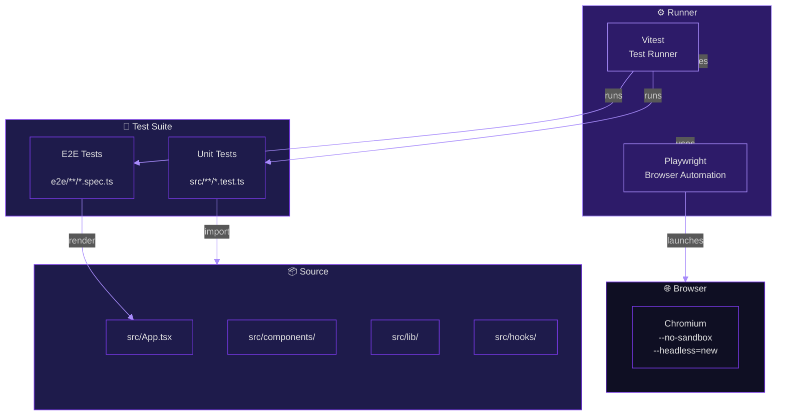

<!-- AGENT PROMPT: Please update this file after every message if it is relevant. Continuous updates ensure that the documentation accurately reflects the current state of the codebase, project specification, and architectural principles. -->

# ts-play Testing

## Table of Contents

- [Test Framework](#test-framework)
- [Running Tests](#running-tests)
- [Unit Tests](#unit-tests)
- [E2E Tests](#e2e-tests)
- [Writing Tests](#writing-tests)
- [Coverage](#coverage)
- [Browser Testing](#browser-testing)

## Test Framework

ts-play uses **Vitest** as the test runner with **Playwright** for browser-based e2e testing. Both are configured in `vitest.config.ts`.

- **Vitest** — Unit and integration tests with native Vite integration
- **vitest-browser-react** — React component testing in a real browser
- **Playwright** — Cross-browser e2e automation

### Test Architecture



- **Vitest** — Unit and integration tests with native Vite integration
- **vitest-browser-react** — React component testing in a real browser
- **Playwright** — Cross-browser e2e automation

## Running Tests

```bash
# Run all tests (unit + e2e)
pnpm test

# Run tests in watch mode
pnpm test --watch

# Run only unit tests
pnpm test -- --testPathPattern="src/"

# Run only e2e tests
pnpm test -- --testPathPattern="e2e/"
```

The test configuration includes both `src/**/*.test.ts` and `e2e/**/*.spec.ts`.

## Unit Tests

Unit tests live alongside source files using the `.test.ts` suffix. Example: `src/lib/ansi.test.ts`, `src/lib/shareCodec.test.ts`.

**Pattern:**

```ts
import { test, expect } from 'vitest'
// Import the module under test

test('description', () => {
  // Arrange
  // Act
  // Assert
})
```

## E2E Tests

E2E tests live in the `e2e/` directory using the `.spec.ts` suffix. Example: `e2e/happy-path.spec.ts`, `e2e/problems-offset.spec.ts`.

**Pattern:**

```ts
import { test, expect } from 'vitest'
import { render } from 'vitest-browser-react'
import { page } from 'vitest/browser'
import { App } from '../src/App'
import React from 'react'

test('description', async () => {
  render(React.createElement(App))

  const element = page.getByTestId('element-id')
  await expect.element(element).toBeVisible()

  await element.click()
  // Assert outcome
})
```

**Key APIs:**

- `render(React.createElement(Component))` — Mounts a React component in the browser
- `page.getByTestId('id')` — Finds an element by its `data-testid` attribute
- `page.getByText('text')` — Finds an element by its text content
- `expect.element(element).toBeVisible()` — Asserts element visibility
- `element.click()` — Clicks an element
- `page.waitForTimeout(ms)` — Waits for a specified duration

## Writing Tests

### Test Structure

Follow the arrange-act-assert pattern:

1. **Arrange** — Set up state, render components, configure mocks
2. **Act** — Trigger the behavior (click, type, navigate)
3. **Assert** — Verify the outcome

### Test IDs

Use `data-testid` attributes for interactive elements:

```tsx
<button data-testid='header-run-button'>Run</button>
```

### Mocking

Use `vi.fn()` from Vitest for mock functions:

```ts
import { vi } from 'vitest'
const mockFn = vi.fn()
```

### Async Testing

Use `await` for all browser interactions:

```ts
await runButton.click()
await expect.element(consoleContainer).toBeVisible()
```

## Coverage

Coverage is tracked via Vitest's built-in coverage reporter. Run with:

```bash
pnpm test -- --coverage
```

Target: meaningful coverage for all new code, especially error handling paths and edge cases.

## Browser Testing

Tests run in a Chromium browser instance configured via `@vitest/browser-playwright`. The browser is launched with:

- `--no-sandbox`
- `--disable-setuid-sandbox`
- `--headless=new`

**Cross-Origin requirements:** The test server sets `Cross-Origin-Embedder-Policy: require-corp` and `Cross-Origin-Opener-Policy: same-origin` headers to enable SharedArrayBuffer usage required by esbuild-wasm.

### Playwright Smoke Test

For manual browser verification, use the Playwright MCP server:

```bash
npx @playwright/mcp@0.0.80
```

Navigate to `http://localhost:5173` and verify key flows:

1. Code editing and compilation
2. Package installation
3. Sharing functionality
4. Theme switching
